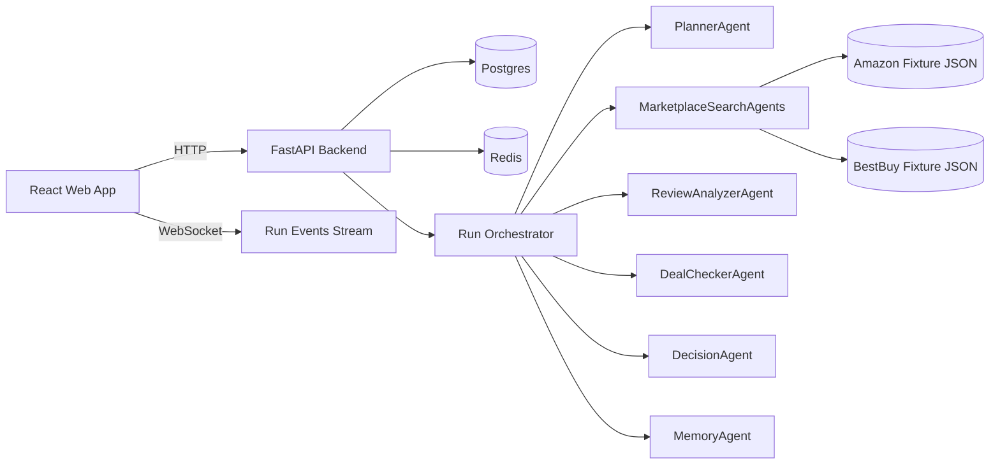
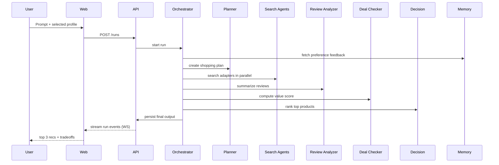

# Architecture

## Components

## Agent flow

## Data model overview

- `users`: local auth identities (email/password hash).
- `profiles`: per-user shopping profiles and preferences.
- `runs`: lifecycle of each shopping run (`created -> planning -> searching -> analyzing -> ranking -> done|error`).
- `run_events`: persisted agent events for replay and live streaming.
- `product_snapshots`: candidate product artifacts captured during a run.
- `feedback`: user feedback signals (`pick`, `not_interested`, `preference`) used by MemoryAgent.

## Runtime behavior

- Run orchestration is deterministic and heuristics-based (no LLM dependency required).
- Provider adapters use local fixtures with simulated latency and timeout/error handling.
- Event streaming uses WebSocket with persisted history replay on reconnect.
